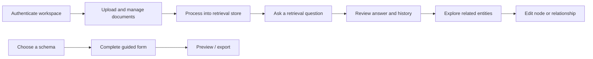

# Nexus

> A knowledge workspace that combines document ingestion, retrieval queries, editable knowledge graphs, and schema-driven forms.

## Overview

Nexus is a web workspace for turning source documents into searchable, explainable knowledge. Users can upload and manage documents, tune retrieval behavior, inspect chat history, visualize graph relationships, edit entities and edges, configure API access, and complete schema-driven forms. The case study focuses on the custom application layer and integration experience around a LightRAG-compatible API, with clear health, authentication, and network states.

## My contribution

- React 19 + TypeScript application shell with routed retrieval, documents, graph, API, and admin surfaces
- Document manager with supported-file guidance, upload state, deletion, and status feedback
- Retrieval workspace with query settings, history, response modes, API health, and retry behavior
- Sigma/Graphology visualization with node search, layout controls, focus, editable properties, and graph state management
- RJSF/MUI schema-driven form builder, preview, reusable claim/form schemas, and PDF-oriented previews
- Firebase authentication, Firestore connectivity state, access controls, multilingual labels, and theme support
- Reusable Radix/MUI/Tailwind UI primitives, data tables, dialogs, command search, toasts, and responsive layouts

## Skills demonstrated

| Area | Applied |
| --- | --- |
| AI product UX | Document ingestion, retrieval controls, chat history, response states, and API health |
| Knowledge graphs | Sigma rendering, Graphology models, layout algorithms, search, focus, and editable nodes/edges |
| Form systems | JSON Schema forms, UI schemas, previews, validation, PDF-ready output, and form navigation |
| React / TypeScript | Zustand stores, typed API clients, feature boundaries, hooks, and reusable primitives |
| Platform integration | LightRAG-compatible API, Firebase Auth/Firestore, i18next, file upload, and local persistence |
| Product quality | Empty/error/loading states, retry/backoff helpers, network status, theming, and accessibility-minded controls |

## Representative flow

## Technical stack

React 19 · TypeScript · Vite · Zustand · Sigma · Graphology · RJSF · MUI · Radix UI · Tailwind CSS · Firebase Auth/Firestore · i18next · Axios · jsPDF.

See [architecture](docs/ARCHITECTURE.md), [user flows](docs/USER-FLOWS.md), [security policy](SECURITY.md), [screenshot guide](docs/SCREENSHOT-GUIDE.md), and [GitHub setup](docs/GITHUB-SETUP.md).
"# nexus" 
