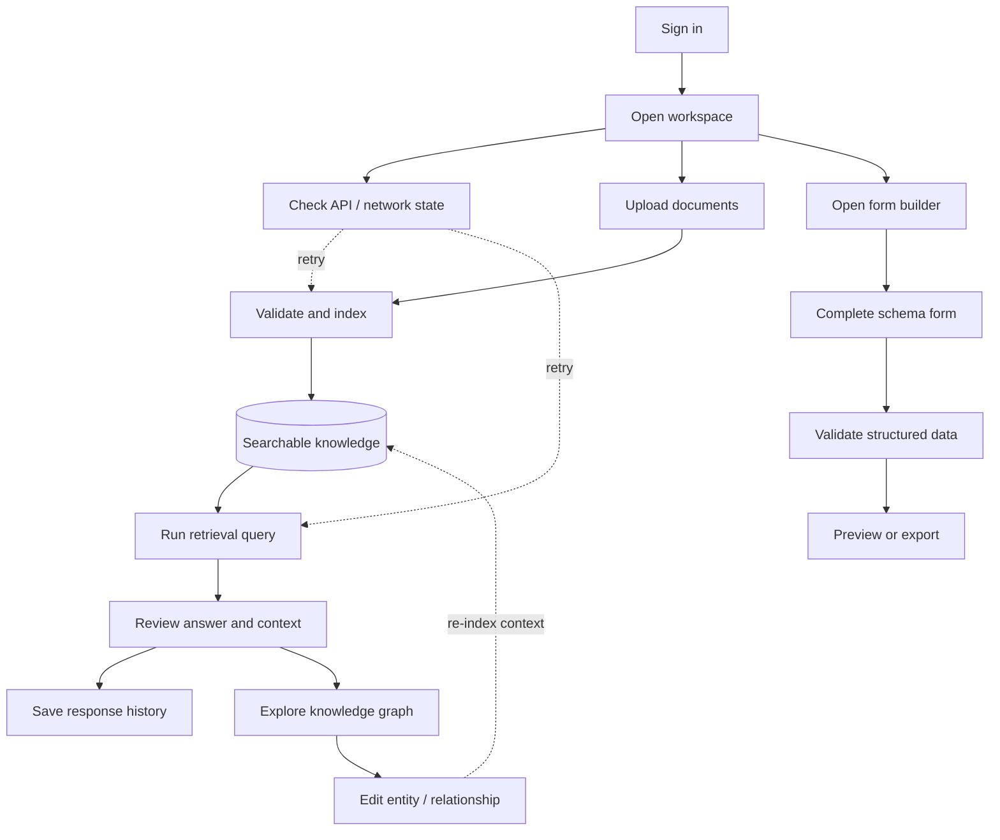

# User flows

## Explainable retrieval journey

The user can move from a document set to a retrieval answer, then inspect the connected graph context instead of treating the response as a black box. Settings, graph limits, response modes, and network status remain visible so the workflow is debuggable and repeatable. The same workspace can turn reviewed knowledge into a validated, schema-driven output.
